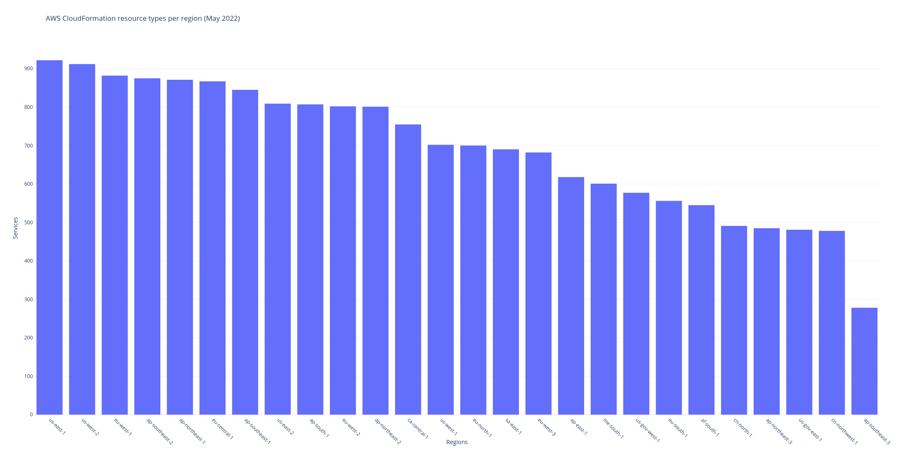

# [IP addresses per region](https://github.com/PatMyron/cloud/issues/11)
</img>
</img>
</img>

# [compute / memory unit prices by virtual machine type](https://instances.vantage.sh/)


# product / feature regional availability




<details>
<summary><a href="https://azure.microsoft.com/en-us/global-infrastructure/services/?products=all&regions=all">Azure services per region</a></summary>

```python
from bs4 import BeautifulSoup

# save webpage locally to ensure table has fully loaded
soup = BeautifulSoup(open('https://azure.microsoft.com/en-us/global-infrastructure/services/?products=all&regions=all'), 'html.parser')
for row in soup.find_all('tr', class_='service-row', attrs={'data-product-slug' : True}):
    for cell in row.find_all(attrs={'data-region-slug' : True}):
        if 'Not available' not in cell.text:
            print(cell['data-region-slug'])
```

```shell
python3 azure.py | sort | uniq -c | sort -nr | grep -v 'non-regional'
# Azure services per region
```
</details>

# [availability zones per region](https://github.com/PatMyron/cloud/issues/16)

https://aws.amazon.com/about-aws/global-infrastructure/regions_az/

https://cloud.google.com/about/locations/

https://docs.microsoft.com/en-us/azure/availability-zones/az-overview


# instance type regional availability
```shell
for REGION in $(aws ec2 describe-regions --query "Regions[*].RegionName" --output text)
do
  echo $REGION
  curl -s https://pricing.us-east-1.amazonaws.com/offers/v1.0/aws/AmazonEC2/current/$REGION/index.json | jq -r '.products[].attributes["instanceType"]' | sort -u | grep '\.' | sed 's/\..*//' | sort -u
done

# EC2 instance type regional availability
# tl;dr: new regions do not offer old instance types

cmr5 t3 (newer regions with no previous generation instance types):
eu-north-1
ap-east-1
me-south-1
us-gov-east-1

------------

r4-5:
eu-west-3
eu-west-2
ca-central-1
cn-northwest-1

r3-5:
ap-south-1
eu-west-1
ap-northeast-3
ap-northeast-2
ap-northeast-1
ap-southeast-1
ap-southeast-2
eu-central-1
sa-east-1
us-east-1
us-east-2
us-west-1
us-west-2
us-gov-west-1
cn-north-1

----------------

cm4-5:
ap-south-1
eu-west-3
eu-west-2
us-east-2
ca-central-1
cn-northwest-1

cm3-5:
eu-central-1
ap-northeast-3
ap-northeast-2

c3-5 m1-5:
cn-north-1

-------------

t2-t3:
ap-south-1
eu-west-3
eu-west-2
ap-northeast-3
ap-northeast-2
ca-central-1
eu-central-1
us-east-2
cn-north-1
cn-northwest-1

---------------

cm1-5 t1-3 (oldest regions with all previous generation instance types):
eu-west-1
ap-northeast-1
sa-east-1
ap-southeast-1
ap-southeast-2
us-east-1
us-west-1
us-west-2
us-gov-west-1
```

# [CloudFormation / Terraform trivia](https://twitter.com/iann0036/status/1537613464943796224)


```shell
$ curl -s -N --compressed https://d1uauaxba7bl26.cloudfront.net/latest/gzip/CloudFormationResourceSpecification.json | pcregrep -o1 '          "(.*?)"' | sort | uniq -c | sort -nr
# missing a few https://github.com/awsdocs/aws-cloudformation-user-guide/issues/4#issuecomment-503828259
5443 UpdateType # property fields
5443 Required
5443 Documentation
4283 PrimitiveType
1493 Type
 448 ItemType
 445 DuplicatesAllowed
 352 PrimitiveItemType

$ curl -s -N --compressed https://d1uauaxba7bl26.cloudfront.net/latest/gzip/CloudFormationResourceSpecification.json | pcregrep -o1 '^      "(.*?)"' | sort | uniq -c | sort -nr
1448 Documentation # resource fields
1444 Properties
 144 Attributes
   4 UpdateType
   4 Type
   4 Required
   4 ItemType
   2 PrimitiveType
   1 AdditionalProperties

$ curl -s -N --compressed https://d1uauaxba7bl26.cloudfront.net/latest/gzip/CloudFormationResourceSpecification.json | pcregrep -o1 '("UpdateType": ".*?)"' | sort | uniq -c | sort -nr
4030 "UpdateType": "Mutable
1370 "UpdateType": "Immutable
  47 "UpdateType": "Conditional

$ curl -s -N --compressed https://d1uauaxba7bl26.cloudfront.net/latest/gzip/CloudFormationResourceSpecification.json | pcregrep -o1 '("Required": .*?),' | sort | uniq -c | sort -nr
3689 "Required": false
1758 "Required": true

$ curl -s -N --compressed https://d1uauaxba7bl26.cloudfront.net/latest/gzip/CloudFormationResourceSpecification.json | pcregrep -o1 '("DuplicatesAllowed": .*?),' | sort | uniq -c | sort -nr
 313 "DuplicatesAllowed": false
 132 "DuplicatesAllowed": true

$ curl -s -N --compressed https://d1uauaxba7bl26.cloudfront.net/latest/gzip/CloudFormationResourceSpecification.json | pcregrep -o1 '("PrimitiveType": .*?),' | sort | uniq -c | sort -nr
3046 "PrimitiveType": "String"
 382 "PrimitiveType": "Integer"
 368 "PrimitiveType": "Boolean"
  99 "PrimitiveType": "Json"
  63 "PrimitiveType": "Double"
   8 "PrimitiveType": "Long"
   4 "PrimitiveType": "Timestamp"
   1 "PrimitiveType": "Map"

$ curl -s -N --compressed https://d1uauaxba7bl26.cloudfront.net/latest/gzip/CloudFormationResourceSpecification.json | pcregrep -o1 '("PrimitiveItemType": .*?),' | sort | uniq -c | sort -nr
 349 "PrimitiveItemType": "String"
   2 "PrimitiveItemType": "Boolean"
   1 "PrimitiveItemType": "Json"

$ curl -s -N --compressed https://d1uauaxba7bl26.cloudfront.net/latest/gzip/CloudFormationResourceSpecification.json | pcregrep -o1 '("Type": .*?),' | sort | uniq -c | sort -nr
 735 "Type": "List"
  48 "Type": "Map"
  ..

$ curl -s -N --compressed https://d1uauaxba7bl26.cloudfront.net/latest/gzip/CloudFormationResourceSpecification.json | pcregrep -o1 '("ItemType": .*?),' | sort | uniq -c | sort -nr
 108 "ItemType": "Tag"
 ...

$ curl -s --compressed https://d1uauaxba7bl26.cloudfront.net/latest/gzip/CloudFormationResourceSpecification.json | jq '.ResourceTypes' | jq 'with_entries(.value |= .Attributes)' | grep -v ': null' | grep -v 'Type": "'
# GetAtt attributes

$ curl -s -N --compressed https://d1uauaxba7bl26.cloudfront.net/latest/gzip/CloudFormationResourceSpecification.json | pcregrep -o1 '::(.*)::' | sort | uniq -c | wc -l
# services

$ curl -s --compressed https://d1uauaxba7bl26.cloudfront.net/latest/gzip/CloudFormationResourceSpecification.json | jq '.ResourceTypes | length'
# resource types

$ curl -s --compressed https://d1uauaxba7bl26.cloudfront.net/latest/gzip/CloudFormationResourceSpecification.json | jq '.PropertyTypes | length'
# property types

$ curl -s -N --compressed https://d1uauaxba7bl26.cloudfront.net/latest/gzip/CloudFormationResourceSpecification.json | pcregrep -o1 '::(.*)::[^.]*"' | sort | uniq -c | sort -nr
# resource types per service

$ diff -u <(curl -s https://s3.eu-west-1.amazonaws.com/cfn-resource-specifications-eu-west-1-prod/latest/CloudFormationResourceSpecification.json | jq '.ResourceTypes | keys' | jq -S) <(curl -s https://s3.us-west-2.amazonaws.com/cfn-resource-specifications-us-west-2-prod/latest/CloudFormationResourceSpecification.json | jq '.ResourceTypes | keys' | jq -S)
# resource type difference between two regions

$ curl -s -N https://raw.githubusercontent.com/patmyron/aws-cloudformation-user-guide/master/doc_source/cfn-resource-specification.md | pcregrep -o1 -o2 "|  (\w*-\w*-\w* ) .*//(.*?).cloudfront.*" | xargs -L1 bash -c 'curl -s -N --compressed https://$1.cloudfront.net/latest/gzip/CloudFormationResourceSpecification.json | pcregrep -o1 "::(.*)::" | sort | uniq -c | wc -l | xargs echo -n; echo " $0"' | sort -nr
for REGION in ap-east-1 me-south-1 af-south-1 eu-south-1 ap-southeast-3 us-gov-west-1 us-gov-east-1
do
  curl -s -N https://s3.$REGION.amazonaws.com/cfn-resource-specifications-$REGION-prod/latest/CloudFormationResourceSpecification.json | pcregrep -o1 '::(.*)::' | sort | uniq -c | wc -l | xargs echo -n; echo " $REGION"
done
for REGION in cn-north-1 cn-northwest-1
do
  curl -s -N https://s3.$REGION.amazonaws.com.cn/cfn-resource-specifications-$REGION-prod/latest/CloudFormationResourceSpecification.json | pcregrep -o1 '::(.*)::' | sort | uniq -c | wc -l | xargs echo -n; echo " $REGION"
done
# CloudFormation services per region

$ curl -s -N https://raw.githubusercontent.com/patmyron/aws-cloudformation-user-guide/master/doc_source/cfn-resource-specification.md | pcregrep -o1 -o2 "|  (\w*-\w*-\w* ) .*//(.*?).cloudfront.*" | xargs -L1 bash -c 'curl -s -N --compressed https://$1.cloudfront.net/latest/gzip/CloudFormationResourceSpecification.json | pcregrep -o1 "::(.*)::[^.]*\"" | wc -l | xargs echo -n; echo " $0"' | sort -nr
for REGION in ap-east-1 me-south-1 af-south-1 eu-south-1 ap-southeast-3 us-gov-west-1 us-gov-east-1
do
  curl -s -N https://s3.$REGION.amazonaws.com/cfn-resource-specifications-$REGION-prod/latest/CloudFormationResourceSpecification.json | pcregrep -o1 '::(.*)::[^.]*"' | wc -l | xargs echo -n; echo " $REGION"
done
for REGION in cn-north-1 cn-northwest-1
do
  curl -s -N https://s3.$REGION.amazonaws.com.cn/cfn-resource-specifications-$REGION-prod/latest/CloudFormationResourceSpecification.json | pcregrep -o1 '::(.*)::[^.]*"' | wc -l | xargs echo -n; echo " $REGION"
done
# resource types per region

$ curl -s -N --compressed https://d1uauaxba7bl26.cloudfront.net/latest/gzip/CloudFormationResourceSpecification.json | pcregrep -o1 '^        "(.*?)"' | sort | uniq -c | sort -nr | head -n 30
 223 Name
 137 Tags
 107 Description
  84 Type
  77 Arn
  59 Value
  46 Id
  44 Key
  43 RoleArn
  41 Enabled
  25 Port
  24 Parameters
  24 InstanceType
  22 Version
  22 AvailabilityZone
  21 SubnetId
  20 SubnetIds
  19 Values
  19 SecurityGroupIds
  18 VpcId
  17 RoleARN
  17 DomainName
  16 KmsKeyId
  16 ApiId
  15 Protocol
  15 MetricName
  14 Path
  14 ApplicationName
  14 ApplicationId
  13 Attributes
```

```shell
terraform providers schema -json | jq '.provider_schemas ."registry.terraform.io/hashicorp/aws" .resource_schemas | length'
# resource types
```
