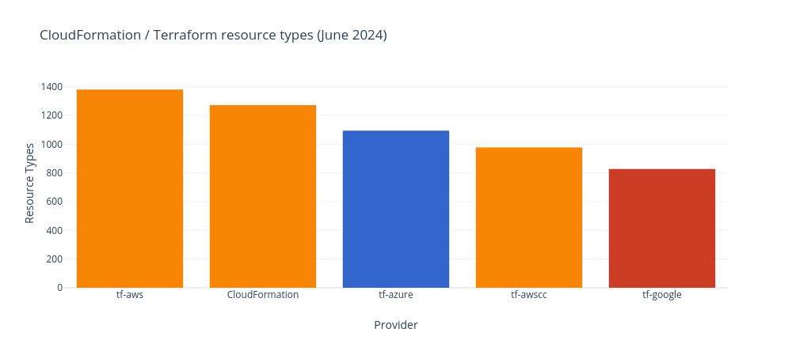

# [IP addresses per region](https://github.com/PatMyron/cloud/issues/11)
</img>
</img>
</img>

# [compute / memory unit prices by virtual machine type](https://instances.vantage.sh/)
</img>
</img>
</img>

# product / feature regional availability
</img>
</img>
</img>
</img>
</img>
</img>

<details>
<summary><a href="https://azure.microsoft.com/en-us/global-infrastructure/services/?products=all&regions=all">Azure services per region</a></summary>

```python
from bs4 import BeautifulSoup

# save webpage locally to ensure table has fully loaded
soup = BeautifulSoup(open('https://azure.microsoft.com/en-us/global-infrastructure/services/?products=all&regions=all'), 'html.parser')
for row in soup.find_all('tr', class_='service-row', attrs={'data-product-slug' : True}):
    for cell in row.find_all(attrs={'data-region-slug' : True}):
        if 'Not available' not in cell.text:
            print(cell['data-region-slug'])
```

```shell
python3 azure.py | sort | uniq -c | sort -nr | grep -v 'non-regional'
# Azure services per region
```
</details>

# [availability zones per region](https://github.com/PatMyron/cloud/issues/16)

https://aws.amazon.com/about-aws/global-infrastructure/regions_az/

https://cloud.google.com/about/locations/

https://learn.microsoft.com/en-us/azure/reliability/availability-zones-service-support

</img>

# instance type regional availability
```shell
for REGION in $(aws ec2 describe-regions --query "Regions[*].RegionName" --output text)
do
  echo $REGION
  curl -s https://pricing.us-east-1.amazonaws.com/offers/v1.0/aws/AmazonEC2/current/$REGION/index.json | jq -r '.products[].attributes["instanceType"]' | sort -u | grep '\.' | sed 's/\..*//' | sort -u
done

# EC2 instance type regional availability
# tl;dr: new regions do not offer old instance types

cmr5 t3 (post-Feb 2018 regions without previous generation instance types):
eu-north-1
ap-east-1
me-south-1
us-gov-east-1

------------

r4-5:
eu-west-[23]
ca-central-1
cn-northwest-1

r3-5:
ap-south-1
eu-west-1
ap-northeast-[123]
ap-southeast-[12]
eu-central-1
sa-east-1
us-(east|west)-[12]
us-gov-west-1
cn-north-1

----------------

cm4-5:
ap-south-1
eu-west-[23]
us-east-2
ca-central-1
cn-northwest-1

cm3-5:
eu-central-1
ap-northeast-[23]

c3-5 m1-5:
cn-north-1

-------------

t2-t3:
ap-south-1
eu-west-[23]
ap-northeast-[23]
ca-central-1
eu-central-1
us-east-2
cn-north(west)-1

---------------

cm1-5 t1-3 (9 oldest (pre-2013) regions with all previous generation instance types):
eu-west-1
ap-northeast-1
sa-east-1
ap-southeast-[12]
us-east-1
us-west-[12]
us-gov-west-1
```

# [CloudFormation / Terraform](https://twitter.com/iann0036/status/1537613464943796224)
</img>

```shell
$ curl -s -N --compressed https://d1uauaxba7bl26.cloudfront.net/latest/gzip/CloudFormationResourceSpecification.json | pcregrep -o1 '^( {6}( {4})?".*?")'  | sort | uniq -c | sort -nr
# missing a few https://github.com/awsdocs/aws-cloudformation-user-guide/issues/4#issuecomment-503828259
30933           "UpdateType" # property fields
30933           "Required"
30933           "Documentation"
21961           "PrimitiveType"
12121           "Type"
 4123           "DuplicatesAllowed"
 3097           "ItemType"
 1795           "PrimitiveItemType"

 8413       "Documentation" # resource fields
 8398       "Properties"
 1070       "Attributes"
   15       "UpdateType"
   15       "Required"
   11       "Type"
   11       "ItemType"
    4       "PrimitiveType"
    1       "AdditionalProperties"

$ curl -s -N --compressed https://d1uauaxba7bl26.cloudfront.net/latest/gzip/CloudFormationResourceSpecification.json | pcregrep -o1 '("(DuplicatesAllowed|(Primitive(Item)?|Update)Type|Required)": .*?),' | sort | uniq -c | sort -k2,2 -k1nr
  121 "DuplicatesAllowed": false
   24 "DuplicatesAllowed": true

 1452 "PrimitiveItemType": "String"
   23 "PrimitiveItemType": "Double"
   19 "PrimitiveItemType": "Integer"
    5 "PrimitiveItemType": "Json"

 2519 "PrimitiveType": "String"
  521 "PrimitiveType": "Integer"
  309 "PrimitiveType": "Boolean"
   81 "PrimitiveType": "Json"
   68 "PrimitiveType": "Double"
    1 "PrimitiveType": "Long"

22523 "Required": false
 8425 "Required": true

21192 "UpdateType": "Mutable"
 4518 "UpdateType": "Immutable"
  303 "UpdateType": "Conditional"

$ curl -s -N --compressed https://d1uauaxba7bl26.cloudfront.net/latest/gzip/CloudFormationResourceSpecification.json | pcregrep -o1 '("(Item)?Type": .*?),' | sort | uniq -c | sort -nr | head
4583 "Type": "List"
 729 "ItemType": "Tag"
 307 "Type": "Map"
 ...

$ curl -s --compressed https://d1uauaxba7bl26.cloudfront.net/latest/gzip/CloudFormationResourceSpecification.json | jq '.ResourceTypes' | jq 'with_entries(.value |= .Attributes)' | grep -v ': null' | grep -v 'Type": "'
# GetAtt attributes

$ curl -s -N --compressed https://d1uauaxba7bl26.cloudfront.net/latest/gzip/CloudFormationResourceSpecification.json | pcregrep -o1 '::(.*)::' | sort | uniq -c | wc -l
# services

$ curl -s --compressed https://d1uauaxba7bl26.cloudfront.net/latest/gzip/CloudFormationResourceSpecification.json | jq '.ResourceTypes, .PropertyTypes | length'
1371 # resource types
7042 # property types

$ curl -s -N --compressed https://d1uauaxba7bl26.cloudfront.net/latest/gzip/CloudFormationResourceSpecification.json | pcregrep -o1 '::(.*)::[^.]*"' | sort | uniq -c | sort -nr | head
# resource types per service

$ diff -u <(curl -s https://s3.eu-west-1.amazonaws.com/cfn-resource-specifications-eu-west-1-prod/latest/CloudFormationResourceSpecification.json | jq '.ResourceTypes | keys' | jq -S) <(curl -s https://s3.us-west-2.amazonaws.com/cfn-resource-specifications-us-west-2-prod/latest/CloudFormationResourceSpecification.json | jq '.ResourceTypes | keys' | jq -S)
# resource type difference between two regions

$ curl -s -N https://raw.githubusercontent.com/patmyron/aws-cloudformation-user-guide/master/doc_source/cfn-resource-specification.md | pcregrep -o1 -o2 "|  (\w*-\w*-\w* ) .*//(.*?).cloudfront.*" | xargs -L1 bash -c 'curl -s -N --compressed https://$1.cloudfront.net/latest/gzip/CloudFormationResourceSpecification.json | pcregrep -o1 "::(.*)::" | sort | uniq -c | wc -l | xargs echo -n; echo " $0"' | sort -nr
for REGION in ap-east-1 me-south-1 af-south-1 eu-south-1 ap-southeast-3 us-gov-west-1 us-gov-east-1
do
  curl -s -N https://s3.$REGION.amazonaws.com/cfn-resource-specifications-$REGION-prod/latest/CloudFormationResourceSpecification.json | pcregrep -o1 '::(.*)::' | sort | uniq -c | wc -l | xargs echo -n; echo " $REGION"
done
for REGION in cn-north-1 cn-northwest-1
do
  curl -s -N https://s3.$REGION.amazonaws.com.cn/cfn-resource-specifications-$REGION-prod/latest/CloudFormationResourceSpecification.json | pcregrep -o1 '::(.*)::' | sort | uniq -c | wc -l | xargs echo -n; echo " $REGION"
done
# CloudFormation services per region

$ curl -s -N https://raw.githubusercontent.com/patmyron/aws-cloudformation-user-guide/master/doc_source/cfn-resource-specification.md | pcregrep -o1 -o2 "|  (\w*-\w*-\w* ) .*//(.*?).cloudfront.*" | xargs -L1 bash -c 'curl -s -N --compressed https://$1.cloudfront.net/latest/gzip/CloudFormationResourceSpecification.json | pcregrep -o1 "::(.*)::[^.]*\"" | wc -l | xargs echo -n; echo " $0"' | sort -nr
for REGION in ap-east-1 me-south-1 af-south-1 eu-south-1 ap-southeast-3 us-gov-west-1 us-gov-east-1
do
  curl -s -N https://s3.$REGION.amazonaws.com/cfn-resource-specifications-$REGION-prod/latest/CloudFormationResourceSpecification.json | pcregrep -o1 '::(.*)::[^.]*"' | wc -l | xargs echo -n; echo " $REGION"
done
for REGION in cn-north-1 cn-northwest-1
do
  curl -s -N https://s3.$REGION.amazonaws.com.cn/cfn-resource-specifications-$REGION-prod/latest/CloudFormationResourceSpecification.json | pcregrep -o1 '::(.*)::[^.]*"' | wc -l | xargs echo -n; echo " $REGION"
done
# resource types per region

$ curl -s -N --compressed https://d1uauaxba7bl26.cloudfront.net/latest/gzip/CloudFormationResourceSpecification.json | pcregrep -o1 '^( {8}".*?")' | sort | uniq -c | sort -nr | head
 915         "Name"
 860         "Tags"
 482         "Arn"
 471         "Description"
 367         "Type"
  ..
```

```shell
terraform providers schema -json | jq '.provider_schemas ."registry.terraform.io/hashicorp/aws" .resource_schemas | length'
# resource types
```
