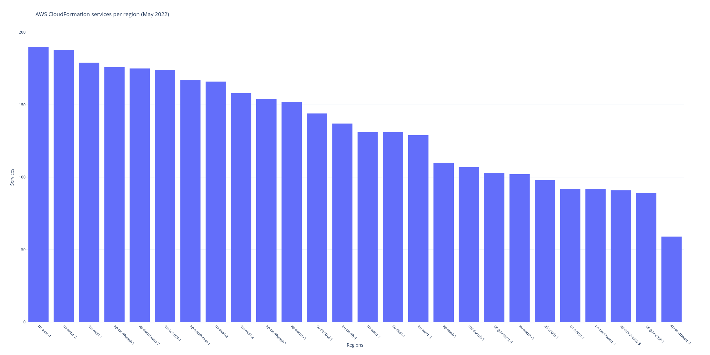

```shell
$ curl -s -N --compressed https://d1uauaxba7bl26.cloudfront.net/latest/gzip/CloudFormationResourceSpecification.json | pcregrep -o1 '          "(.*?)"' | sort | uniq -c | sort -nr
# missing a few https://github.com/awsdocs/aws-cloudformation-user-guide/issues/4#issuecomment-503828259
5443 UpdateType # property fields
5443 Required
5443 Documentation
4283 PrimitiveType
1493 Type
 448 ItemType
 445 DuplicatesAllowed
 352 PrimitiveItemType

$ curl -s -N --compressed https://d1uauaxba7bl26.cloudfront.net/latest/gzip/CloudFormationResourceSpecification.json | pcregrep -o1 '^      "(.*?)"' | sort | uniq -c | sort -nr
1448 Documentation # resource fields
1444 Properties
 144 Attributes
   4 UpdateType
   4 Type
   4 Required
   4 ItemType
   2 PrimitiveType
   1 AdditionalProperties

$ curl -s -N --compressed https://d1uauaxba7bl26.cloudfront.net/latest/gzip/CloudFormationResourceSpecification.json | pcregrep -o1 '("UpdateType": ".*?)"' | sort | uniq -c | sort -nr
4030 "UpdateType": "Mutable
1370 "UpdateType": "Immutable
  47 "UpdateType": "Conditional

$ curl -s -N --compressed https://d1uauaxba7bl26.cloudfront.net/latest/gzip/CloudFormationResourceSpecification.json | pcregrep -o1 '("Required": .*?),' | sort | uniq -c | sort -nr
3689 "Required": false
1758 "Required": true

$ curl -s -N --compressed https://d1uauaxba7bl26.cloudfront.net/latest/gzip/CloudFormationResourceSpecification.json | pcregrep -o1 '("DuplicatesAllowed": .*?),' | sort | uniq -c | sort -nr
 313 "DuplicatesAllowed": false
 132 "DuplicatesAllowed": true

$ curl -s -N --compressed https://d1uauaxba7bl26.cloudfront.net/latest/gzip/CloudFormationResourceSpecification.json | pcregrep -o1 '("PrimitiveType": .*?),' | sort | uniq -c | sort -nr
3046 "PrimitiveType": "String"
 382 "PrimitiveType": "Integer"
 368 "PrimitiveType": "Boolean"
  99 "PrimitiveType": "Json"
  63 "PrimitiveType": "Double"
   8 "PrimitiveType": "Long"
   4 "PrimitiveType": "Timestamp"
   1 "PrimitiveType": "Map"

$ curl -s -N --compressed https://d1uauaxba7bl26.cloudfront.net/latest/gzip/CloudFormationResourceSpecification.json | pcregrep -o1 '("PrimitiveItemType": .*?),' | sort | uniq -c | sort -nr
 349 "PrimitiveItemType": "String"
   2 "PrimitiveItemType": "Boolean"
   1 "PrimitiveItemType": "Json"

$ curl -s -N --compressed https://d1uauaxba7bl26.cloudfront.net/latest/gzip/CloudFormationResourceSpecification.json | pcregrep -o1 '("Type": .*?),' | sort | uniq -c | sort -nr
 735 "Type": "List"
  48 "Type": "Map"
  ..

$ curl -s -N --compressed https://d1uauaxba7bl26.cloudfront.net/latest/gzip/CloudFormationResourceSpecification.json | pcregrep -o1 '("ItemType": .*?),' | sort | uniq -c | sort -nr
 108 "ItemType": "Tag"
 ...

$ curl -s -N --compressed https://d1uauaxba7bl26.cloudfront.net/latest/gzip/CloudFormationResourceSpecification.json | pcregrep -o1 '::(.*)::' | sort | uniq -c | wc -l
      91 # services
      
$ curl -s -N --compressed https://d1uauaxba7bl26.cloudfront.net/latest/gzip/CloudFormationResourceSpecification.json | pcregrep -o1 '::(.*)::[^.]*"' | wc -l
$ curl -s -N --compressed https://d1uauaxba7bl26.cloudfront.net/latest/gzip/CloudFormationResourceSpecification.json | pcregrep -o1 '"(.*?)::[^.]*"' | sort | uniq -c | sort -nr
     423 # resource types
     422 AWS
       1 Alexa

$ curl -s -N --compressed https://d1uauaxba7bl26.cloudfront.net/latest/gzip/CloudFormationResourceSpecification.json | pcregrep -o1 '::(.*)::.*\..*' | wc -l
     970 # property types

$ curl -s -N --compressed https://d1uauaxba7bl26.cloudfront.net/latest/gzip/CloudFormationResourceSpecification.json | pcregrep -o1 '::(.*)::[^.]*"' | sort | uniq -c | sort -nr
  53 EC2 # resource types per service
  19 ApiGateway
  16 Greengrass
  15 Pinpoint
  13 ServiceCatalog
  11 WAFRegional
  11 Glue
  11 ApiGatewayV2
   9 RDS
   9 IAM
   7 WAF
   7 SSM
   7 OpsWorks
   7 Lambda
   7 Cognito
   7 AppStream
   6 SES
   6 RoboMaker
   6 IoT
   6 GuardDuty
   6 ElastiCache
   6 DMS
   6 AppSync
   5 ServiceDiscovery
   5 SageMaker
   5 Redshift
   5 Neptune
   5 Logs
   5 ElasticLoadBalancingV2
   5 EMR
   5 Config
   5 CloudFormation
   5 AutoScaling
   5 AppMesh
   4 SecretsManager
   4 Route53
   4 PinpointEmail
   4 KinesisAnalyticsV2
   4 IoTAnalytics
   4 ElasticBeanstalk
   4 DocDB
   3 SNS
   3 Route53Resolver
   3 KinesisAnalytics
   3 IoT1Click
   3 Inspector
   3 GameLift
   3 ECS
   3 DAX
   3 CodePipeline
   3 CodeDeploy
   3 CloudFront
   3 Batch
   3 Amplify
   3 AmazonMQ
   2 Transfer
   2 StepFunctions
   2 SQS
   2 S3
   2 Kinesis
   2 KMS
   2 Events
   2 EFS
   2 DirectoryService
   2 CloudWatch
   2 ApplicationAutoScaling
   1 WorkSpaces
   1 SDB
   1 RAM
   1 OpsWorksCM
   1 MediaStore
   1 MSK
   1 KinesisFirehose
   1 IoTThingsGraph
   1 FSx
   1 Elasticsearch
   1 ElasticLoadBalancing
   1 EKS
   1 ECR
   1 DynamoDB
   1 DataPipeline
   1 DLM
   1 CodeCommit
   1 CodeBuild
   1 CloudTrail
   1 Cloud9
   1 CertificateManager
   1 Budgets
   1 AutoScalingPlans
   1 Athena
   1 ASK

$ curl -s -N https://raw.githubusercontent.com/awsdocs/aws-cloudformation-user-guide/master/doc_source/cfn-resource-specification.md | pcregrep -o1 "//(.*?).cloudfront.*"
  d2senuesg1djtx # CloudFormationResourceSpecification buckets
  d2zq80gdmjim8k
  d1ane3fvebulky
  doigdx0kgq9el
  d2stg8d246z9di
  d33vqc0rt9ld30
  d2s8ygphhesbe7
  d1mta8qj7i28i2
  d3teyb21fexa9r
  d1742qcu2c1ncx
  d2d0mfegowb3wk
  diy8iv58sj6ba
  d3c9jyj3w509b0
  d1uauaxba7bl26
  dnwj8swjjbsbt
  d68hl49wbnanq
  d201a2mn26r7lk

$ curl -s -N https://raw.githubusercontent.com/patmyron/aws-cloudformation-user-guide/master/doc_source/cfn-resource-specification.md | pcregrep -o1 -o2 "|  (\w*-\w*-\w* ) .*//(.*?).cloudfront.*" | xargs -L1 bash -c 'curl -s -N --compressed https://$1.cloudfront.net/latest/gzip/CloudFormationResourceSpecification.json | pcregrep -o1 "::(.*)::" | sort | uniq -c | wc -l | xargs echo -n; echo " $0"' | sort -nr
94 us-west-2 # services per region
94 us-east-1
94 eu-west-1
87 ap-northeast-1
85 eu-central-1
85 ap-southeast-2
84 us-east-2
77 ap-southeast-1
76 ap-northeast-2
74 eu-west-2
70 ap-south-1
68 us-west-1
64 ca-central-1
59 eu-west-3
56 sa-east-1
51 eu-north-1
48 us-gov-west-1
46 cn-north-1
46 cn-northwest-1
45 ap-east-1
45 us-gov-east-1
44 me-south-1
43 ap-northeast-3

$ curl -s -N https://raw.githubusercontent.com/patmyron/aws-cloudformation-user-guide/master/doc_source/cfn-resource-specification.md | pcregrep -o1 -o2 "|  (\w*-\w*-\w* ) .*//(.*?).cloudfront.*" | xargs -L1 bash -c 'curl -s -N --compressed https://$1.cloudfront.net/latest/gzip/CloudFormationResourceSpecification.json | pcregrep -o1 "::(.*)::[^.]*\"" | wc -l | xargs echo -n; echo " $0"' | sort -nr
432 us-east-1 # resource types per region
432 eu-west-1
431 us-west-2
397 ap-northeast-1
393 eu-central-1
388 ap-southeast-2
362 us-east-2
337 ap-northeast-2
335 ap-southeast-1
328 ap-south-1
327 eu-west-2
301 us-west-1
291 ca-central-1
266 eu-west-3
263 sa-east-1
228 eu-north-1
222 us-gov-west-1
211 cn-north-1
210 us-gov-east-1
206 cn-northwest-1
203 ap-east-1
189 me-south-1
189 ap-northeast-3

$ curl -s -N --compressed https://d1uauaxba7bl26.cloudfront.net/latest/gzip/CloudFormationResourceSpecification.json | pcregrep -o1 '^        "(.*?)"' | sort | uniq -c | sort -nr | head -n 30
 223 Name
 137 Tags
 107 Description
  84 Type
  77 Arn
  59 Value
  46 Id
  44 Key
  43 RoleArn
  41 Enabled
  25 Port
  24 Parameters
  24 InstanceType
  22 Version
  22 AvailabilityZone
  21 SubnetId
  20 SubnetIds
  19 Values
  19 SecurityGroupIds
  18 VpcId
  17 RoleARN
  17 DomainName
  16 KmsKeyId
  16 ApiId
  15 Protocol
  15 MetricName
  14 Path
  14 ApplicationName
  14 ApplicationId
  13 Attributes
```

```python
from bs4 import BeautifulSoup

# save webpage locally to ensure table has fully loaded
soup = BeautifulSoup(open('https://azure.microsoft.com/en-us/global-infrastructure/services/?products=all&regions=all'), 'html.parser')
for row in soup.find_all('tr', class_='service-row', attrs={'data-product-slug' : True}):
    for cell in row.find_all(attrs={'data-region-slug' : True}):
        if 'Not available' not in cell.text:
            print(cell['data-region-slug'])
```

```shell
$ python azure.py | sort | uniq -c | sort -nr | grep -v 'non-regional'
 119 europe-west # Azure services per region
 116 europe-north
 114 us-east
 113 us-east-2
 113 australia-east
 112 asia-pacific-southeast
 111 us-south-central
 108 us-west-2
 108 japan-east
 107 us-west
 105 united-kingdom-south
 104 us-central
 101 canada-central
 101 brazil-south
 101 asia-pacific-east
 100 central-india
  98 us-north-central
  97 korea-central
  96 usgov-virginia
  93 uae-north
  92 us-west-central
  92 france-central
  89 australia-southeast
  87 south-africa-north
  87 japan-west
  86 canada-east
  85 united-kingdom-west
  84 china-east-2
  83 south-india
  74 west-india
  72 usgov-texas
  69 korea-south
  68 usgov-arizona
  66 china-north
  63 china-east
  61 china-north-2
  58 us-dod-central
  58 australia-central
  55 us-dod-east
  54 germany-central
  54 australia-central-2
  53 south-africa-west
  52 france-south
  50 uae-central
  49 germany-northeast
  44 usgov-iowa
```

```shell
25 asia-northeast1 # Google Cloud products per region
23 us-east4
23 us-east1
22 us-central1
22 europe-west1
22 asia-east2
21 europe-west2
21 australia-southeast1
21 asia-south1
20 us-west2
20 southamerica-east1
20 northamerica-northeast1
19 asia-southeast1
19 asia-northeast2
18 asia-east1
17 europe-west6
17 europe-west3
16 us-west1
16 europe-west4
16 europe-north1
```
